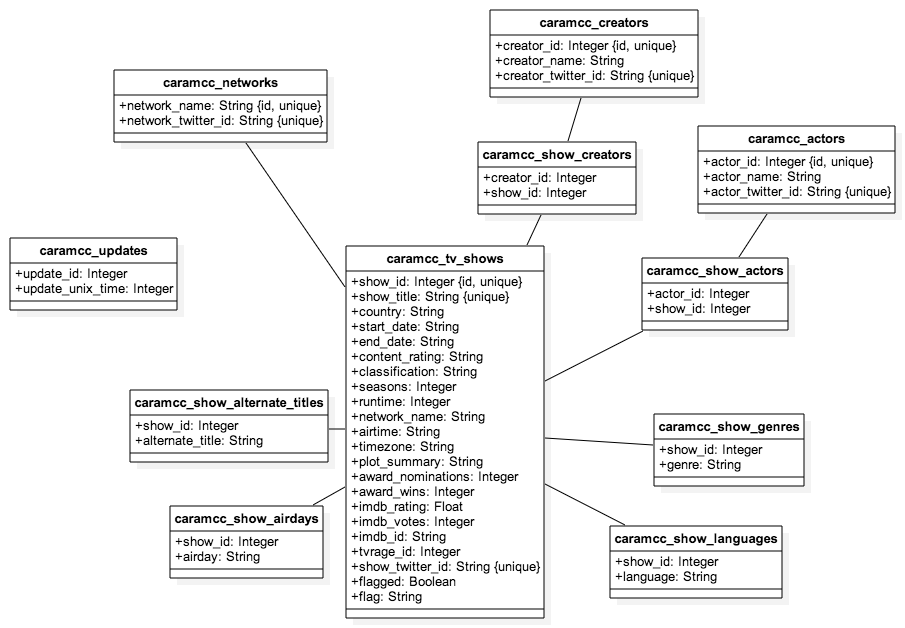

# Access

This database belongs to the [Bangerz](http://bangerz.co) data repository.

On the Bangerz server, it is located in the directory `~/caramcc/`.

# Set Up Locally

1. Clone or Fork this GitHub Repository.

1. `cd` into `ruby-scripts/`.

1. Modify database info in `constants.rb` as follows:
   - set `$db_name` to the name of the database being used
   - set `$host` to the host address, usually `'localhost'`
   - set `$username` to the user accessing the database, usually `'root'`
   - set `$password` to the user's password, if necessary

1. Run `ruby create_tables.rb` to create all the tables.

1. Run `ruby populate_tables.rb` to populate the tables with the starter JSON (located in `ruby-scripts/output-data/`) May take several minutes.

1. Run `ruby content_ratings.rb` to add content ratings to tv_shows table. This may take awhile, as content ratings were not stored in initial starter JSON. Makes API calls to OMDB.

# Sources of Data:

[TV Rage API](http://services.tvrage.com/info.php?page=main) is used to generate a list of the TV Shows that will be included in the table.
TV Rage API is also used to populate the table with the majority of the fields.

[OMDb API](http://www.omdbapi.com/) is used to supplement the data with some additional information.

[FanPageList](http://fanpagelist.com/) is used to gather twitter handles for shows, networks, and actors

# Scripts

## Setup Scripts

- `create_tables.rb` - used to create all tables.

- `populate_tables.rb` - used to fill all tv_show related tables and the tables that map between them.

- `content_ratings.rb` - used to add content ratings to tv_shows table, pulling data directly from OMDb.

## Data Maintenance Scripts

- `sort_through_flags.rb` - removes flags from shows likely to be correct, then generates json file of each remaining flagged show, sorted by flag, for manual review.

- `updates.rb` - Queries tvrage for any changes since the last update. Updates shows accordingly. Should be run between once per day and once per week.

- `imdb_updates.rb` - Looks for IMDb data for all shows without an `imdb_id`. Will take awhile to run and make a lot of API calls. Should be run once or twice per month.

- `ruby update_one.rb [--imdb | --tvr] <show_id> <imdb_id | tvrage_id>` - manually update the imdb data or tvrage data for a given show, given a new `imdb_id` or `tvrage_id`. Params are: flag to denote whether the imdb data or tvrage data is being updated, the `show_id` of the show in question, the new `imdb_id` or `tvrage_id`

## Runnable Scripts

These scripts can be executed from the command line with arguments to execute certain queries. They are located in `ruby-scripts/`.

- `ruby details.rb <show_title> [-f]` - outputs all of the fields for the show with the specified `show_title`. The optional flag `-f` matches a show that contains the title string, i.e., performs a query `WHERE show_title LIKE '%show_title%'`

- `ruby id_del.rb <*show_ids>` - deletes the tv show with the specified `show_id`s, e.g. `ruby id_del.rb 123 901 292` will delete the shows with IDs 123, 901, and 292.

- `ruby show-suggest <show_title> <n> [-f] [-d]` - finds `n` shows most similar to the given `show_title`. The optional flag `-f` does a wildcard search on the given `show_title` (`LIKE '%show_title%'`). The optional flag `-d` provides some details about the match relevance.

## Data Acquisition Scripts

The data was downloaded and reformatted using the following scripts, located in the `ruby-scripts/` directory:

- `tv_show_titles.rb` - used to get the primary list of all TV shows to include in the table. It writes the titles to a json file, which is read by another script.

- `threaded_tv_show_data.rb` - used to get the majority of the data on each TV show. Reads from the previously generated json file to get the list of shows to look up, then query both the TV Rage API and the OMDb API for more detailed data about each show. Writes the output to a json file in the form `caramcc_tv_show_data_*.json`.

- `nsy_threaded_tv_show_data.rb` - similar to `threaded_tv_show_data.rb`, but does not match start year for the TV shows when searching for data on OMDb.

- `scraperbot/twitter_handle_scraper.rb` - used to scrape twitter handles from FanPageList.

# Data Auditing

## Validity/ Accuracy:

All of the manually audited data on the TV Rage API appeared to be correct. About 97% of the manually audited data on OMDb was found to be correct.

As the data is retrieved from the APIs, the `tv_show_data.rb` script checks for discrepancies between the TV Rage API and the OMDb API. Any data with discovered discrepancies are flagged for manual review and given a brief note about what went wrong.

## Completeness:

There isn't much data on how many TV Shows there are or have ever been overall. One unsourced answer on Answers.com suggested that there were upwards of 1,000,000, which seems incorrect.

There are 45,639 TV Shows in my database.

According to [The Benton Foundation](https://www.benton.org/node/65435), in 2011 there were 1,774 TV channels. Assuming 12 distinct shows per channel per day (1 per hour, the rest being re-runs) for 5 days a week, with each show running for approximately 8 years (factoring in that many news programs will balance out shorter-lived scripted series) since 1970 (45 years ago) we have:
1774 channels x 12 shows per channel per day x 5 days x 45 years / 8 years per show = 598,725 shows

I have about 0.76% of all shows. Since many of these shows will be older, unpopular, or obscure, this seems somewhat reasonable, especially in the scope of shows people are currently tweeting about.

## Consistency/Uniformity:

The most frequent cause of inconsistency among the data comes from the TV Show not appearing in the OMDb API. The majority of the data comes from the TV Rage API, however, which generally consists of most (if not all) of the same fields. Missing OMDb data results in a missing section for Language, Writers, Actors, Award Wins and Nominations, and plot summary, as well as missing IMDb rating and IMDb votes.

Most of the time, missing OMDb data implies that the show is very old and/or obscure. While these shows will still be added to the database (for now) their data might not be relevant or useful as it applies to TV Shows people are tweeting about.

# SQL

SQL to insert the data into my database is found in: `populate_tables.rb`

The data is cleaned on first insertion. Code to clean the data is found in `populate_tables.rb`.

# Use Cases

Tests using the following use cases can be found in the `test-queries` directory. They are each named `example_n.rb` where n = the number given here:

1. I want to determine the TV Show a given Actor has appeared in most recently.
1. I want to determine which is the lowest-rated TV Show made by a given Creator.
1. I want to determine which genres a given Actor appears in most frequently.
1. I want to determine which languages a given TV Show was broadcast in.
1. I want to determine which TV Show made by a given Creator had the most seasons.
1. I want to determine the Twitter Handle of the Network that has aired the most TV Shows in the United States.
1. I want to determine the average IMDB rating for shows aired on the network HBO.
1. I want to determine the titles of all the shows broadcast on NBC.
1. I want to determine how many TV Shows a given Creator has made.
1. I want to determine which TV Show broadcast in the UK has received the most IMDB votes.

# Database Schema

## UML Diagram

## Relationships

1. `caramcc_tv_shows` --- one-to-many ---> `caramcc_show_languages`
  - foreign key: `caramcc_show_languages.show_id`

1. `caramcc_tv_shows` --- one-to-many ---> `caramcc_show_genres`
  - foreign key: `caramcc_show_genres.show_id`

1. `caramcc_tv_shows` --- one-to-many ---> `caramcc_show_airdays`
  - foreign key: `caramcc_show_airdays.show_id`

1. `caramcc_tv_shows` --- one-to-many ---> `caramcc_show_alternate_titles`
  - foreign key: `caramcc_show_alternate_titles.show_id`

1. `caramcc_networks` --- one-to-many ---> `caramcc_tv_shows`
  - foreign key: `caramcc_tv_shows.network_name`

1. `caramcc_tv_shows` <--- many-to-many through `caramcc_show_creators` ---> `caramcc_creators`
  - map table: `caramcc_show_creators`
    - foreign key: `caramcc_tv_shows.show_id`
    - foreign key: `caramcc_creators.creator_id`

1. `caramcc_tv_shows` <--- many-to-many through `caramcc_show_actors` ---> `caramcc_actors`
  - map table: `caramcc_show_actors`
    - foreign key: `caramcc_tv_shows.show_id`
    - foreign key: `caramcc_actors.actor_id`
    
    
# Tables

## caramcc_tv_shows

The table `caramcc_tv_shows` represents a television show.

### Attributes

- *Primary Key:* `show_id`

- *Foreign Key:* `network_name`
  - references table `caramcc_networks`
  
- *Other Notable Fields:*
  - `flagged` - denotes an entry that should be reviewed manually for data validity
  - `flag` - brief descriptor about why the data should be reviewed manually

## caramcc_networks

The table `caramcc_networks` represents a network that produces tv shows.

### Attributes

- *Primary Key:* `network_name`

## caramcc_show_genres

The table `caramcc_show_genres` represents the genres each show is classified as.

### Attributes

- *Primary Key:* (composite) `(show_id, genre)`

- *Foreign Key:* `show_id`
  - references table `caramcc_tv_shows`

## caramcc_show_languages

The table `caramcc_show_languages` represents the languages each show is aired in.

### Attributes

- *Primary Key:* (composite) `(show_id, language)`

- *Foreign Key:* `show_id`
  - references table `caramcc_tv_shows`

## caramcc_show_airdays

The table `caramcc_show_airdays` represents the day of the week each show is aired on.

### Attributes

- *Primary Key:* (composite) `(show_id, airday)`

- *Foreign Key:* `show_id`
  - references table `caramcc_tv_shows`

## caramcc_show_alternate_titles

The table `caramcc_show_alternate_titles` represents other titles that reference the a given show.

### Attributes

- *Primary Key:* (composite) `(show_id, alternate_title)`

- *Foreign Key:* `show_id`
  - references table `caramcc_tv_shows`

## caramcc_show_actors

The table `caramcc_show_actors` maps between `caramcc_tv_shows` and `caramcc_actors`.

### Attributes

- *Primary Key:* (composite) `(actor_id, show_id)`

- *Foreign Key:* `actor_id`
  - references table `caramcc_actors`
  
- *Foreign Key:* `show_id`
  - references table `caramcc_tv_shows`

## caramcc_show_creators

The table `caramcc_show_creators` maps between `caramcc_tv_shows` and `caramcc_creators`.

### Attributes

- *Primary Key:* (composite) `(creator_id, show_id)`

- *Foreign Key:* `creator_id`
  - references table `caramcc_creators`
  
- *Foreign Key:* `show_id`
  - references table `caramcc_tv_shows`

## caramcc_show_creators

The table `caramcc_creators` represents the main staff responsible for the creation of a show (usually writers, directors, or producers).

### Attributes

- *Primary Key:* `creator_id`

## caramcc_show_actors

The table `caramcc_actors` represents the main cast of a show.

### Attributes

- *Primary Key:* `actor_id`

# Views

- `caramcc_all_show_genres` - all show data joined with genre data
- `caramcc_all_show_languages` - all show data joined with language data
- `caramcc_all_show_creators` - all show data joined with creator data
- `caramcc_all_show_actors` - all show data joined with actor data
- `caramcc_actor_genres` - actor name joined with genres the actor has appeared in
- `caramcc_creator_genres` - creator name joined with genres the creator has worked on

# License

The MIT License (MIT)

Copyright (c) 2015 Cara McCormack

Permission is hereby granted, free of charge, to any person obtaining a copy
of this software and associated documentation files (the "Software"), to deal
in the Software without restriction, including without limitation the rights
to use, copy, modify, merge, publish, distribute, sublicense, and/or sell
copies of the Software, and to permit persons to whom the Software is
furnished to do so, subject to the following conditions:

The above copyright notice and this permission notice shall be included in
all copies or substantial portions of the Software.

THE SOFTWARE IS PROVIDED "AS IS", WITHOUT WARRANTY OF ANY KIND, EXPRESS OR
IMPLIED, INCLUDING BUT NOT LIMITED TO THE WARRANTIES OF MERCHANTABILITY,
FITNESS FOR A PARTICULAR PURPOSE AND NONINFRINGEMENT. IN NO EVENT SHALL THE
AUTHORS OR COPYRIGHT HOLDERS BE LIABLE FOR ANY CLAIM, DAMAGES OR OTHER
LIABILITY, WHETHER IN AN ACTION OF CONTRACT, TORT OR OTHERWISE, ARISING FROM,
OUT OF OR IN CONNECTION WITH THE SOFTWARE OR THE USE OR OTHER DEALINGS IN
THE SOFTWARE.