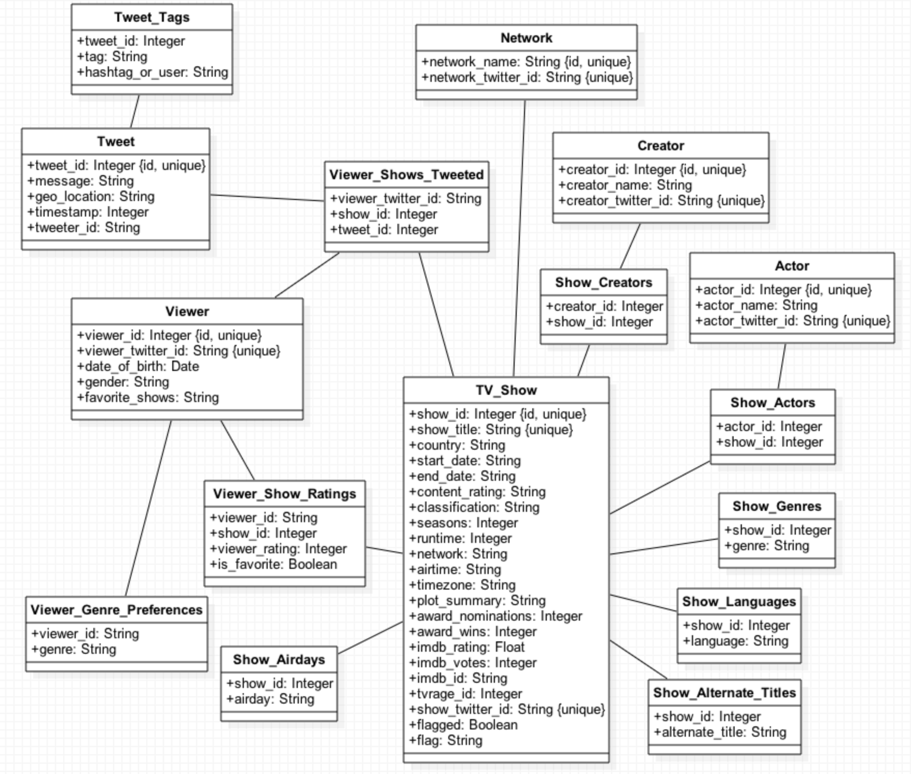

# Sources of Data:

[TV Rage API](http://services.tvrage.com/info.php?page=main) is used to generate a list of the TV Shows that will be included in the table.
TV Rage API is also used to populate the table with the majority of the fields.

[OMDb API](http://www.omdbapi.com/) is used to supplement the data with some additional information.

[FanPageList](http://fanpagelist.com/) is used to gather twitter handles for shows, networks, and actors

# Scripts

The data was downloaded and reformatted using the following scripts, located in the `ruby-scripts/` directory:

- `tv_show_titles.rb` - used to get the primary list of all TV shows to include in the table. It writes the titles to a json file, which is read by another script.

- `threaded_tv_show_data.rb` - used to get the majority of the data on each TV show. Reads from the previously generated json file to get the list of shows to look up, then query both the TV Rage API and the OMDb API for more detailed data about each show. Writes the output to a json file in the form `caramcc_tv_show_data_*.json`.

- `query_table.rb` - when run in command line with the args `show title` and `network`, queries database and produces a list of show titles for shows that contain both params. Pass an empty string to either field to generate all show titles for a given network, or shows whose titles contain a certain string across all networks. Will be renamed eventually.

- `sort_through_flags.rb` - generates json file of each flagged show, sorted by flag, for manual review.

- `scraperbot/twitter_handle_scraper.rb` - used to scrape twitter handles from FanPageList.

- `populate_tables.rb` - used to fill the following tables: TV_Shows, Actors, Creators, the tables that map between them, and `show_genres`, `show_airdays`, `show_languages`, and `show_alt_titles`, which provide atomic representations of non-atomic data.

- `populate_networks_and_show_handles.rb` - used to fill the Networks table, as well as to add twitter handle data about TV Shows and Networks.

# Data Auditing

## Validity/ Accuracy:

All of the manually audited data on the TV Rage API appeared to be correct. About 97% of the manually audited data on OMDb was found to be correct.

As the data is retrieved from the APIs, the `tv_show_data.rb` script checks for discrepancies between the TV Rage API and the OMDb API. Any data with discovered discrepancies are flagged for manual review and given a brief note about what went wrong.

## Completeness:

There isn't much data on how many TV Shows there are or have ever been overall. One unsourced answer on Answers.com suggested that there were upwards of 1,000,000, which seems incorrect.

There are 45,639 TV Shows in my database.

According to [The Benton Foundation](https://www.benton.org/node/65435), in 2011 there were 1,774 TV channels. Assuming 12 distinct shows per channel per day (1 per hour, the rest being re-runs) for 5 days a week, with each show running for approximately 8 years (factoring in that many news programs will balance out shorter-lived scripted series) since 1970 (45 years ago) we have:
1774 channels x 12 shows per channel per day x 5 days x 45 years / 8 years per show = 598,725 shows

I have about 0.76% of all shows. Since many of these shows will be older, unpopular, or obscure, this seems somewhat reasonable, especially in the scope of shows people are currently tweeting about.

## Consistency/Uniformity:

The most frequent cause of inconsistency among the data comes from the TV Show not appearing in the OMDb API. The majority of the data comes from the TV Rage API, however, which generally consists of most (if not all) of the same fields. Missing OMDb data results in a missing section for Language, Writers, Actors, Award Wins and Nominations, and plot summary, as well as missing IMDb rating and IMDb votes.

Most of the time, missing OMDb data implies that the show is very old and/or obscure. While these shows will still be added to the database (for now) their data might not be relevant or useful as it applies to TV Shows people are tweeting about.

# SQL

SQL to insert the data into my database is found in: `populate_tables.rb` and `populate_networks_and_show_handles.rb`

The data is cleaned on first insertion. Code to clean the data is found in `populate_tables.rb`.

# Tests

Tests using the following use cases can be found in the `test-queries` directory. They are each named `example_n.rb` where n = the number given here:

1. I want to determine the TV Show a given Actor has appeared in most recently.
1. I want to determine which is the lowest-rated TV Show made by a given Creator.
1. I want to determine which genres a given Actor appears in most frequently.
1. I want to determine which languages a given TV Show was broadcast in.
1. I want to determine which TV Show made by a given Creator had the most seasons.
1. I want to determine the Twitter Handle of the Network that has aired the most TV Shows in the United States.
1. I want to determine the average IMDB rating for shows aired on the network HBO.
1. I want to determine the titles of all the shows broadcast on NBC.
1. I want to determine how many TV Shows a given Creator has made.
1. I want to determine which TV Show broadcast in the UK has received the most IMDB votes.

# Database Schema

